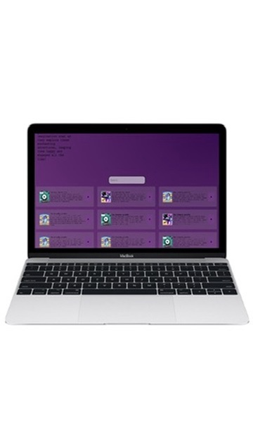
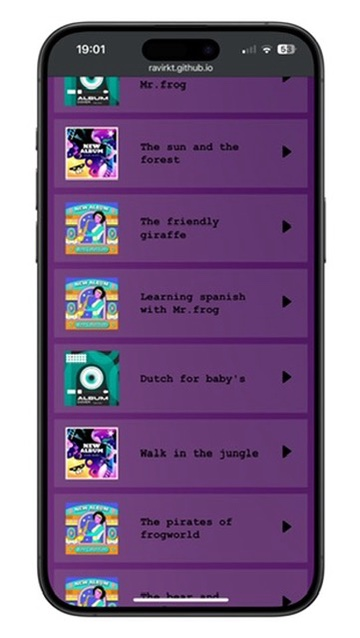
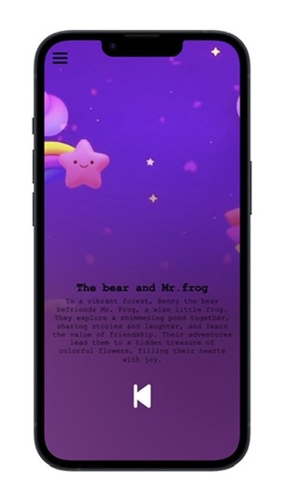
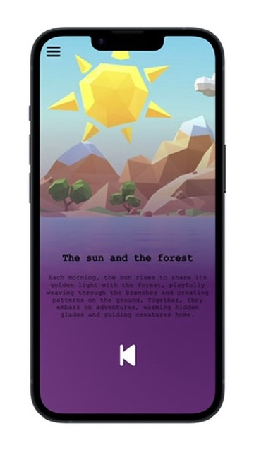

# Intro
Tumi-mundo wil een platform waarmee baby’s van 6 maanden tot een jaar hun taalontwikkeling kunnen verbeteren en stimuleren omdat dit voordelen heeft voor het leerproces, vermindering van geestelijke ziektes en het vergroten van sociale vaardigheden.

Als schoolproject heb ik de opdracht gekregen van Tumi Mundo om de frontend van hun website te maken. Voor de eerste sprint was het de bedoeling dat de aangeleverde ontwerpen en de funcitonaliteiten daarin gerealiseerd moesten worden. Hierbij de vrijheid om een een ander design aan te houden en zelf te mogen bepalen welke pagina of functionaliteit de prioriteit kreeg.

https://github.com/Ravirkt/the-client-website

## Inhoudsopgave
- [Intro](#intro)
  - [Inhoudsopgave](#inhoudsopgave)
  - [Beschrijving](#beschrijving)
    - [Features](#features)
  - [Kenmerken](#kenmerken)
    - [HTMl-structuur](#html-structuur)
    - [CSS](#css)
    - [Javascript](#javascript)

## Beschrijving
In deze eerste sprint heb ik de focus gelegd op de audioplayer en de storiespagina van de webapplicatie. Het doel was om een gebruiksvriendelijke ervaring te creëren voor het ontdekken en afspelen van muziek en verhalen, met een goede weergave op verschillende apparaten.

### Features
Audioplayer
De audioplayer maakt het mogelijk om verhalen af te spelen. Gebruikers kunnen de video pauzeren en opnieuw afspelen, zodat ze zelf de controle hebben.

Storiespagina
De storiespagina geeft een overzicht van alle huidige verhalen. Dit maakt het gemakkelijk voor gebruikers om snel te vinden wat ze willen luisteren.

Navigatiesysteem
Een gebruiksvriendelijk navigatiesysteem helpt gebruikers om makkelijk door de applicatie te bladeren.

## Kenmerken

### HTMl-structuur
Ik heb de standaard HTML-structuur gebruikt om de basis van de applicatie op te bouwen. Dit maakt het eenvoudig en duidelijk om te begrijpen en onderhouden. Hier heb ik rekening gehouden dat alles semantic is.

### CSS
Voor de styling heb ik me gericht op de lay-out. Ik heb CSS grid gebruikt om een overzichtelijke indeling te maken. Ook heb ik media queries toegepast, zodat de applicatie goed werkt op verschillende apparaten, van mobiel tot desktop.

### Javascript
In de applicatie heb ik JavaScript gebruikt voor interactie. Voor het openen en sluiten van de navbar heb ik gebruikgemaakt van query selectors. Daarnaast heb ik de play- en pauzeknop voor de video's ook met JavaScript gemaakt, waarbij ik event listeners heb gebruikt om te reageren op de acties van de gebruiker. Dit zorgt ervoor dat ze eenvoudig kunnen schakelen tussen afspelen en pauzeren.

